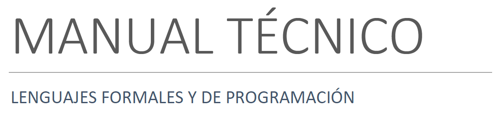
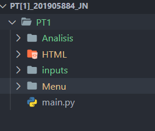
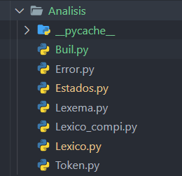
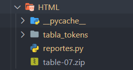

<link href='media/css/style.css' rel='stylesheet' type='text/css'></link>

# Manual Técnico

 
 

Santiago Julián Barrera Reyes 
201905884 
Sección N 
Catedrático 
Ing. Kevin Adiel Lajpop Ajpacajá 
Tutor académico 
Pablo Fernando Cabrera Pineda 
“Id y enseñad a todos” 
 
 

## Índice   
1. [Introducción](#id1)
2. [Objetivos](#id2)
3. [Requerimientos](#id3)
4. [Instalación y Configuración](#id4)
5. [Diagrama Entidad Relación](#id5)
6. [Automás Generados](#id6)
7. [Configuración del Sistema](#id7)
   1. [Estructura Raíz](#id7.1)
   2. [Directorio Analisis](#id7.2)
   3. [Directorio HTML](#id7.3)

 
 

## Introducción
Este manual describe los pasos necesarios para que cualquier estudiante con bases en la programación y desarrollo de autómatas pueda realizar la correcta ejecución del software creado.

Es importante tener en cuenta que el presente manual hace mención a las especificaciones sobre cómo desarrollar una gramática regular y el proceso que se realizó para crearla.

 

## Objetivos
Brindar la información necesaria para poder realizar la instalación y configuración del software presentado. Además de su integración al análisis léxico.

- Desarrollar una solución de software implementando un analizador léxico mediante autómatas.
- Aplique los conocimientos adquiridos en el laboratorio, del lenguaje de programación Python.

 

## Requerimientos
REQUERIMIENTOS MÍNIMOS DE HARDWARE

- Procesador: Core
- Memoria RAM: Mínimo: 2 Gigabytes (GB)
- Disco Duro: 32Gb.

REQUERIMIENTOS MÍNIMOS DE SOFTWARE

- Privilegios de administrador
- Sistema Operativo: Windows 8 o 10 o 11
- Python: 3.10.3

 

## Instalación y Configuración
Ingresa a la carpeta donde se encuentra el programa descargado, abre una terminal con la ruta de la carpeta e inicializa el main.py en la terminal genera.

Otra manera es teniendo instalado el ID visual estudio puede abrirlo con esta herramienta y correr el archivo main.py desde el mismo para su ejecución.

 

## Diagrama Entidad Relación
A continuación, se muestra el diagrama relacional de las tablas que componen el sistema:

 
 

## Tokens Generados
A continuación, se muestra la Tabla de tokens:

| Token             | Descripción                         | Patrón                                                  |
| ----------------- | ----------------------------------- | ------------------------------------------------------- |
| comment_line      | Comentario de una Linea             | //.\*                                                   |
| comment_multiLine | Comentario multilinea Linea         | (\/\*([[^\*]\n])\*\*\/ )                                |
| tipo_int          | Tipo de dato int                    | int                                                     |
| tipo_double       | Tipo de dato double                 | double                                                  |
| tipo_string       | Tipo de dato string                 | string                                                  |
| tipo_char         | Tipo de dato char                   | char                                                    |
| tipo_boolean      | Tipo de dato boolean                | boolena                                                 |
| tipo              | Tipo de dato                        | tipo_int/tipo_double/tipo_string/tipo_char/tipo_boolean |
| identificador     | Simbolo nombre entidad              | ^([a-zA-Z_])([\w]*)                                     |
| operator_Ar       | Operador aritmetico suma            | +                                                       |
| operator_Ar       | Operador aritmetico resta           | -                                                       |
| operator_Ar       | Operador aritmetico multiplicacion  | \*                                                      |
| operator_Ar       | Operador aritmetico division        | /                                                       |
| operator_Ar       | Operador aritmetico resto           | %                                                       |
| operator_As       | Operador de asignación              | =                                                       |
| operator_Rs       | Operador de relacion Igualacion     | ==                                                      |
| operator_Rs       | Operador de relacion Diferenciacion | !=                                                      |
| operator_Rs       | Operador de relacion Mayor          | >                                                       |
| operator_Rs       | Operador de relacion Mayor igual    | >=                                                      |
| operator_Rs       | Operador de relacion Menor          | <                                                       |
| operator_Rs       | Operador de relacion Menor igual    | <=                                                      |
| operator_Ls       | Operador logico and                 | &&                                                      |
| operator_Ls       | Operador logico or                  | ||                                                      |
| operator_Ls       | Operador logico not                 | !                                                       |
| dato_int          | Tipo de dato int                    | [+-]?([0-9]+)                                           |
| dato_double       | Tipo de dato double                 | [+-]?([0-9]*[.])?[0-9]+                                 |
| dato_string       | Tipo de dato string                 | "([[^"](\")])*"                                         |
| dato_char         | Tipo de dato char                   | '([[^'](\')])'                                          |
| dato_boolean      | Tipo de dato boolean                | ^(false|true)                                           |
| dato              | Dato de cualquier tipo              | dato_int/dato_double/dato_string/dato_char/dato_boolean |
| conditional_if    | Estructura condicional if           | if                                                      |
| conditional_else  | Estructura condicional else         | else                                                    |
| iterative_do      | Estructura iterativa do             | do                                                      |
| iterative_while   | Estructura iterativa while          | while                                                   |
| parA              | Paréntesis abierto                  | (                                                       |
| parB              | Paréntesis cerrado                  | )                                                       |
| punto_coma        | Punto y coma                        | ;                                                       |
| llaveA            | Llave abierta                       | {                                                       |
| llaveB            | Llave cerrada                       | }                                                       |
| metodo_void       | Metodo void                         | void                                                    |
| coma              | Operador coma                       |  ,                                                      |
| metodo_run        | Retorna un valor                    |  return                                                 |
| corA              | Corchete abierto                    | [                                                       |
| corB              | Corchete cerrado                    | ]                                                       |
| punto             | Operador punto                      | .                                                       |

 
 

## Automás Generados
A continuación, se muestran los automás  elaborados en el proyecto por medio del metodo del arbol:

 
 

## Configuración del Sistema
El sistema SimpleC esta desarrollado bajo el lenguaje Python en su versión 3.10.3, esto da la facilidad de estructurar el sistema de manera que facilita el mantenimiento y la correcta ejecución de este, se describe la estructura básica del sistema y se enfatiza en los archivos y directorios relevantes para su configuración y adaptación.

### Estructura Raíz
El proyecto SimpleC tiene su estructura en directorios:

 
 

A continuación, describiremos los directorios y archivos más importantes.

### Directorio Analisis 
Analisis es usado como el directorio que contiene los analizadores y procesador de errores léxicos. 

Este es considerado el directorio más importante del proyecto.

 
 

- **Lexico**: Procesa el flujo de caracteres
- **Lexema**: genera la descripcion, valor, patron, fila y columna de la expresión almacenada.
- **Token**: Es la palabra clave con la cual se guarda en el lexema.
- **Error**: Da estructura a los Errores Léxicos generados en la aplicación.

### Directorio HTML 
Se encarga de generar el reporte HTML del archivo procesado.

 
 

